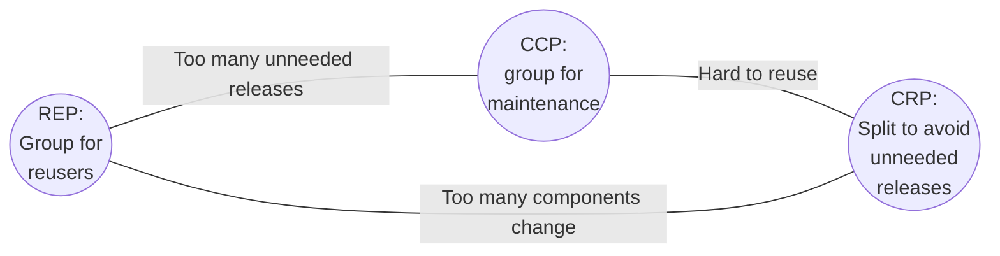

{: .left height="300" width="200" }
Written by Robert C. Martin (a.k.a. "Uncle Bob"),
[Clean Architecture: A Craftsman's Guide to Software Structure and Design](https://www.amazon.ca/gp/product/0134494164)
offers guidance on how to engineer your software product's architecture - composed of many components and modules, and
the relations between them - in order to "minimize the human resources required to build and maintain the required
system".

Following are some notes I took after reading the book. Rather than be the end all, be all, this is intended to be a 
living document with notes and annotations added as my understanding grows.

_Check out some other books I've read on the [bookshelf](/bookshelf/)._

# Summary

_Clean Architecture_ lays out recommendations for the high-level structure and ordering of system components (Java jars, Go modules)
in a way that isolates changes in individual modules and minimizing disruptions in the rest. This is accomplished by isolating
components implementing critical business policies from lower-level details like persistence layers or UI components by
having the latter depend on the former and not the other way around (**Dependency Inversion** and the **Dependency Rule**).

Although clearly aware of "entities" and "business logic", _Clean Architecture_ does not delve into the details of the
process of determining what logic should be "business logic" vs. what shouldn't be; for that I think the reader should
head towards more specialized resources such as Eric Evan's
[Domain Driven Design: Tackling Complexity in the Heart of Software](https://www.amazon.ca/Domain-Driven-Design-Tackling-Complexity-Software/dp/0321125215).

Nevertheless, _Clean Architecture_ steers the reader into thinking about software features in an "inside-out" manner:
figure out the core business logic, then figure out the use cases, then plug in the rest of the details like the
database repositories, external service calls, and view components. This is a fantastic way of thinking about software
design and I wish more teams would adopt this mindset.

# The goal of clean architecture

> The goal of software architecture is to minimize the human resources required to build and maintain the required system.
> 
> _Chapter I: What is Design and Architecture?_

The goal is achieved by identifying the components that are expected to change frequently versus those that are relatively
stable. The axis of stability is a range of degrees, not a binary condition.

The predominant concept at work is the _Dependency Rule_ by far.

# What are components?

> Components are units of deployment. They are the smallest entities that can be deployed as part of a system. In Java,
> they are .jar files. In Ruby, they are gem files. In .Net, they are DLLs. In compiled languages, they are aggregations
> of binary files. In interpreted languages, they are aggregations of source files. In all languages, they are the granule
> of deployment.
> 
> _Chapter 12: Components_

As per this definition, a "component" in Go would be a [module](https://go.dev/doc/code#Organization).

# What are modules?

> The simplest definition is just a source file. [...] a module is a cohesive set of functions and data structures.
> 
> _Chapter 7: The Single Responsibility Principle_

As per this definition, a Java "module" would be a class whereas the Go analog is a [package](https://go.dev/doc/code#Organization).

# SOLID Principles

Part III _Design Principles_ is devoted to a recap of [SOLID principles](https://en.wikipedia.org/wiki/SOLID) and how
they "arrange our functions and data structures into classes, and how those classes should be interconnected."

_SOLID principles are employed at the module level._

Uncle Bob wrote previously extensively about SOLID principles in
[Agile Software Development: Principles, Patterns, and Practices](https://www.amazon.ca/Software-Development-Principles-Patterns-Practices/dp/0135974445).
The book is on my reading TODO list.

Of the five principles, perhaps the most relevant one to _Clean Architecture_ is the Dependency Inversion Principle
(chapter 11) since it provides the single most important tool an architect can employ to isolate stable components from
changes in unstable ones and is directly related to the _Dependency Rule_.

# What modules go in which components?

From Chapter 13: Component Cohesion:


_Chapter13, figure 13.1: Cohesion principles tension diagram_

The edges describe the cost of abandoning the principle on the opposite vertex.

## The Reuse/Release Equivalence Principle (REP)

> The granule of reuse is the granule of release.
> 
> _Chapter 13: Component Cohesion_
 
Clearly under-defined. Uncle Bob even admits the advice is weak. Appears to say that release snapshots should be provided
for components and that their classes and modules must belong to a cohesive group. I agree and recognize tautology when
I see it.

## The Common Closure Principle (CCP)

> Gather into components those classes that change for the same reasons and at the same times. Separate into different
> components those classes that change at different times and for different reasons.

## The Common Reuse Principle (CRP)

> Don't force users of a component to depend on things they don't need.

Uncle Bob argues surprisingly strong about this principle, further saying things like:

> Thus when we depend on a component, we want to make sure we depend on every class in that component.

In the modern software development world of downloadable and reusable libraries and APIs, this seems like a very strong
statement to make. Should we make sure we use every single feature of something like [spf13/cobra](https://github.com/spf13/cobra)
or should we reinvent the wheel? Then again, with the recent
[log4j vulnerabilities](https://cve.mitre.org/cgi-bin/cvename.cgi?name=CVE-2021-44832) in mind, the wisdom behind
Uncle Bob's argument is apparent. It seems difficult to choose one or the other.

# How do we manage coupling between components?

In short, use **The Dependency Rule**.

## What is the Dependency Rule?

> Source code dependencies must point only inward, toward higher-level policies.
> 
> _Chapter 22: The Clean Architecture_

{: height="300" width="400"}
_Chapter 22, Figure 22.1: The clean architecture. This image instance was copied from Uncle Bob's article [here](https://blog.cleancoder.com/uncle-bob/2012/08/13/the-clean-architecture.html)._

A pet peeve of mine is when people pretend this image explains itself. It doesn't. There's a lot to unpack in just the
terms alone ("use cases", "controllers", "ports", "flow of control") that you basically have to read the book to properly
understand it. Here's my take:

## Explaining the Clean Onion Diagram

**Concentric circles**

* `Entities`: are where "enterprise business rules" are implemented. These are the "high-level policies" Uncle Bob keeps
  mentioning elsewhere. I don't know why he chose a different term here. Enterprise business rules are those implemented
  by the business whether the software system exists or not. Reference: section **Entities**, Chapter 20, _Business Rules_.
* `Use Cases`: implement the application-specific business rules. These allow the automated software to implement the
  enterprise business rules correctly. Example: after using enterprise business rules to determine whether a customer
  is applicable for a loan, the banking application may then use application business rules to determine whether the
  loan estimation screen should be displayed or not. Reference: section **Use Cases**, Chapter 20, _Business Rules_.
* `Controllers`/`Presenters`/`Gateways`: these are generally the "outer fringes" of your system. They adapt inputs from
  the outside world into messages the use cases can understand, and in turn adapt responses from the use cases into
  outputs for the world.
  * `Controllers`: very similar to the controller in the [MVC design pattern](https://en.wikipedia.org/wiki/Model%E2%80%93view%E2%80%93controller)
    except it hands control off to the use case (a policy-driven component), not a data structure. See _A Typical Scenario_,
    chapter 22, _Clean Architecture_.
  * `Presenters`: not to be confused with the MVC `View`. These adapt the use case response into a view model. See _A Typical Scenario_,
    chapter 22, _Clean Architecture_.
  * `Gateways`: these are commonly termed "clients" for external systems - think "database repository" or "web service client".
    See _Database Gateways_, chapter 23, _Presenters and Humble Objects_.
* The outer blue layer are your web frameworks, your dependency injection frameworks, your database drivers, etc.

The fact that the green and blue layers have different labels makes the diagram confusing.

**Eastward horizontal arrows**

The eastward horizontal arrows connecting layers of the onion represent the direction of source code dependencies.
Eg. something in `DB` uses or implements something in `Gateways`. In turn, something in the latter uses or implements
something `Use Cases`. Something in `Use Cases` uses or implements something in `Entities`. Source code dependencies are
made to point inward, counter to the direction of control, following the dependency inversion principle.

**Diagram lower-right corner**

This is a bit of an interesting diagram because it depicts a pattern hardly ever seen in the wild: a `Controller` captures
an incoming message from the outside world and passes it to a `Use Case`. The `Use Case` produces a response that is
handed over to a `Presenter`, **not** the `Controller`. I suspect this is a rare pattern because of the popularity
of using the web as transport with the browser as the client, and the prevalence and ease of use of web frameworks.

Typical pattern in Go:

```go
// handleCreateOrders is our Controller
func (h *Handler) handleCreateOrders(w http.ResponseWriter, r *http.Request) {
  request := parseRequest(r) // adapt incoming message to a structure defined by the use case
  
  result, err := h.ordersUseCase.Create(request)
  if err != nil {
    http.Error(w, "internal error", http.StatusInternalServerError)
    return
  }
  
  response := marshal(mapResponse(result)) // adapt use case result into view model
  
  _, err = w.write(response) // send the view model
  if err != nil {
    // log error
  }
}
```

Pattern prescribed in _Clean Architecture_:

```go
// handleCreateOrders is our Controller
func (h *Handler) handleCreateOrders(w http.ResponseWriter, r *http.Request) {
  request := parseRequest(r) // adapt incoming message to a structure defined by the use case
  
  // In this case `presenter` is a function injected into `Handler` that constructs `Presenter` implementations.
  // The presenter maps results and errors into the appropriate view models and sends them back to the client.
  h.ordersUseCase.Create(request, h.presenter(w))
}
```

Here's what Uncle Bob calls a "typical scenario":


_Chapter 22, Figure 22.2: A typical scenario for a web-based Java system utilizing a database_

## Foundations of the Dependency Rule

### The Stable Dependencies Principle

> Depend in the direction of stability.
> 
> _Chapter 14: Component Coupling_

### What is meant by "stability"?

A stable component is one that does not depend on other components yet many others depend on it.

Instability of a component:

$$ I = \frac{Fan^{out}}{Fan^{in} + Fan^{out}} ; I \in [0, 1] $$

Where:
* $$ I $$: instability
* $$ Fan^{out} $$: outgoing dependencies. Number of classes inside this component that depend on classes outside
  the component.
* $$ Fan^{in} $$: incoming dependencies. Number of classes outside this component that depend on classes within the
  component.

Building a tool that lets you visualize instabilities of components in a code base would be a neat little project.

### The Stable Abstractions Principle

> A component should be as abstract as it is stable.
> 
> _Chapter 14: Component Coupling_


Makes sense when you think about it. Nothing is more abstract than an interface type. Everything depends on it, yet it
depends on nothing ($$ I = 1 $$).

High-level policies are put into stable components. Since 100% abstract components (like interfaces) cannot implement
policies (only declare them), the best classes would be abstract ones. Abstract classes are also extensible which imparts
the necessary flexibility when these policies change.

Go does not have classes. In Go, high-level policies would be implemented by struct types that depend on interface abstractions
of more unstable components. This aligns very well with the Go convention of
[declaring interfaces where they are used](https://github.com/golang/go/wiki/CodeReviewComments#interfaces), not where
the implementations reside[^1].

_Clean Architecture_ identifies abstract components as the place where high-level business policies should go, and
provides simple formulas for measuring how abstract or stable they are. It does not inform the reader of how to identify
those policies. For that you would head to another resource such as Eric Evan's
[Domain Driven Design: Tackling Complexity in the Heart of Software](https://www.amazon.ca/Domain-Driven-Design-Tackling-Complexity-Software/dp/0321125215).

Uncle Bob does provide some rules of thumb though:

> Source code dependencies always point in the same direction across the boundary and always towards the higher-level
> component.
> 
> _Chapter 18: Boundary Anatomy_

From Chapter 19 _Policy and Level_ we also gather that the further a policy is from both inputs and outputs of the system,
the higher its level.

### How do components communicate with each other?

Emphasis mine:

> [...] the data that crosses the boundaries consists of simple data structures. [...] **We don't want to cheat and
> pass entity objects or database rows.** We don't want the data structures to have any kind of dependency that violates
> the Dependency Rule.

# Footnotes

[^1]: Be careful and thoughtful with this. There is a lot of dogma in the Go community. There are plenty of exceptions to
      this rule. Examples: decorator pattern, first class polymorphic types.
